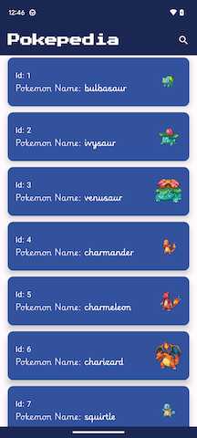
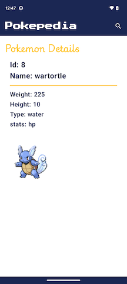

# Pokepedia (Douglas Monsalud)

**Pokepedia** is a simple app that downloads a list of Pokemon from the official PokeApi. When you 
launch the app the first 10 Pokemon are loaded from the API and displayed in a Jetpack Compose 
LazyColumn. Each Pokemon is displayed in a Card with the ID, NAME, and an image of the Pokemon.

Clicking the card takes you to the detail screen, which contains additional information (e.g. 
weight, height, etc). 

## Discussion of Architecture, Frameworks, and Libraries
For this app I chose to use modern Android Frameworks and Libraries. For the UI I am
using Jetpack Compose and Material 3 components. I also imported fonts using Google Fonts and am 
using Coil to load the images using AsyncImage. I chose Compose Navigation for navigation purposes. 

For interacting with the API I am using Ktor as an HTTP Client. I am using Google Gson for 
serialization purposes.

For local storage I implemented a simple Room Database and DAO. The repository gets the API 
download of Pokemon and immediately saves it to Room. The UI gets that list from Room whenever it is 
updated, utilizing a unidirectional data flow that is initiated using Kotlin Flows.

For dependency injection I used Koin. There is a dependency graph defined in the AppModule, which is 
started in the Application class. 

For testing I added a few libraries such as MockK, Espresso, and KotlinX Coroutines Test.

The architecture that I chose is based on the MVVM pattern that Google recommends. I tried to keep a 
separation of concerns and a clean delineation between layers to promote scalability. There are 
Presentation (Composables, ViewModel), Domain(Model, Repository Interface), and Data (RepositoryImpl, 
LocalDataSource and RemoteDataSource Interfaces) layers. Within the Data layer is a DataSource 
package, which contains the LocalDataSourceImpl, RemoteDataSourceImpl, and Room Implementation.

## Instructions for running Pokepedia
After opening the app with an IDE (Android Studio or IntelliJ) make sure these settings are used:
Java 17, Gradle Plugin Version 8.4.2, and Gradle Version 8.6.
